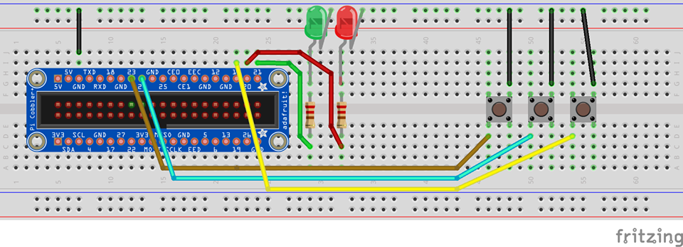

# Assignment 2
##### Dan Michaels and Reuben Lewis, CS300, 03/12/2018

### Fritzing Diagram:


### Board Setup:


### State Diagram:


### Code
```python
'''
Assignment 2: Electronic Combination Lock with Raspberry Pi 3
Date: 3/12/2018, Class: CS 300
Authors: Dan Michaels and Reuben Lewis
'''
import RPi.GPIO as GPIO
import time
GPIO.setmode(GPIO.BCM)

# ---Globals---
BUTTON_1 = 23
BUTTON_2 = 24
BUTTON_3 = 16

LED_G = 21
LED_R = 20

PRESS_1 = 1
PRESS_2 = 2
PRESS_3 = 3
PRESS_4 = 4
RESET   = 5

holder = [0,0,0,0]
pswd = [1,2,3,3]
state = 1
count = 0

# ---Setup GPIOs and Callback Events---
GPIO.setup(BUTTON_1, GPIO.IN, pull_up_down=GPIO.PUD_UP)
GPIO.setup(BUTTON_2, GPIO.IN, pull_up_down=GPIO.PUD_UP)
GPIO.setup(BUTTON_3, GPIO.IN, pull_up_down=GPIO.PUD_UP)
GPIO.setup(LED_G, GPIO.OUT)
GPIO.setup(LED_R, GPIO.OUT)

GPIO.add_event_detect(BUTTON_1, GPIO.FALLING, callback=my_callback, bouncetime = 200)
GPIO.add_event_detect(BUTTON_2, GPIO.FALLING, callback=my_callback, bouncetime = 200)
GPIO.add_event_detect(BUTTON_3, GPIO.FALLING, callback=my_callback, bouncetime = 200)

# --- Function Declarations---
def my_callback(channel):
    global state, holder, pswd, count

    if count < 4:
        button1_input = GPIO.input(BUTTON_1)
        button2_input = GPIO.input(BUTTON_2)
        button3_input = GPIO.input(BUTTON_3)

        # Ensure that a button was actually pressed
        if (button1_input != 1 or button2_input != 1 or button3_input != 1):
            if state == PRESS_1:
                if button1_input == 0:
                    holder[0] = 1
                elif button2_input == 0:
                    holder[0] = 2
                elif button3_input == 0:
                    holder[0] = 3
            elif state == PRESS_2:
                if button1_input == 0:
                    holder[1] = 1
                elif button2_input == 0:
                    holder[1] = 2
                elif button3_input == 0:
                    holder[1] = 3
            elif state == PRESS_3:
                if button1_input == 0:
                    holder[2] = 1
                elif button2_input == 0:
                    holder[2] = 2
                elif button3_input == 0:
                    holder[2] = 3
            elif state == PRESS_4:
                if button1_input == 0:
                    holder[3] = 1
                elif button2_input == 0:
                    holder[3] = 2
                elif button3_input == 0:
                    holder[3] = 3

                # Check the password in the if statement to avoid surprise presses
                if holder == pswd:
                    GPIO.output(LED_G, True)
                    time.sleep(3) # Seconds
                    GPIO.output(LED_G, False)
                else:
                    GPIO.output(LED_R, True)
                    time.sleep(3) # Seconds
                    GPIO.output(LED_R, False)

            state += 1
            count += 1


# --- Main Loop ---
while True:
    if state == RESET:
        print(holder)
        holder = [0, 0, 0, 0]
        state = 1
        count = 0

# Clean up GPIO on normal exit
GPIO.cleanup()

```
